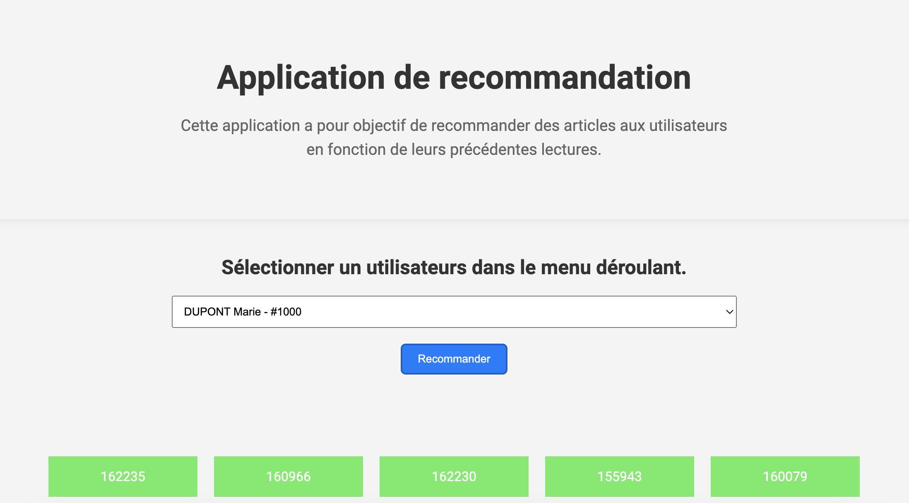

# APP Based Content Filtering

[](LICENSE)

Here is my Content Recommendation App using Based Content Filtering which provides a simple and powerful interface to visualize my explanation of the model training and for testing the model.   

## Description  

This application allows you to view the article recommendation prediction for a certain number of users. To obtain the prediction, the application makes a request to an Azure function which returns a list of recommended articles for the selected user.  



## Table of Contents

- [Getting Started](#Getting-Started)
- [Launch Application](#Launch-Application)
- [Contributing](#Contributing)
- [License](#License)  

## Getting Started  

You can't use my Azure function because of cost management. But if you use your own Azure Function, you can install and use my repository like this.  

```bash
git clone https://github.com/HaDock404/app-based_content_filtering.git
cd app-based_content_filtering
pip install -r ./packages/requirements.txt
```  

## Launch Application  

You can't use my training model because of Github storage. But if you train your own model you can install and use my repository like this.  

```bash
uvicorn main:app --reload
```  

## Contributing

Pull requests are welcome. For major changes, please open an issue first
to discuss what you would like to change.

Please make sure to update tests as appropriate.

## License  

This project is licensed under the MIT License - see the [LICENSE](./LICENSE) file for details.